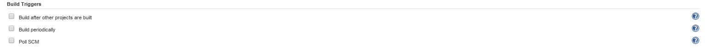
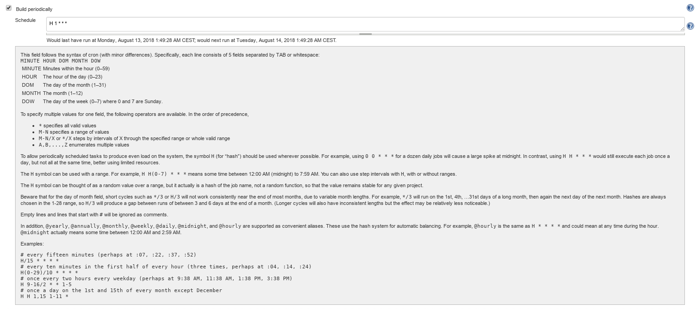

# Build triggers {#build_steps .concept}

Build triggers section allows to set rules for job scheduling based on user needs, job can be started

-   **after other project \(job\) is build** - just type the name of another existing job
-   **periodically** - in predefined time, syntax follows syntax of cron, figure shows detailed explanation
-   **by pooling scm** - asking scm if there were some changes after latest build, the same syntax as previous option

**Parent topic:**[Job anatomy](../../jenkins/job_anatomy/job_anatomy.md)

