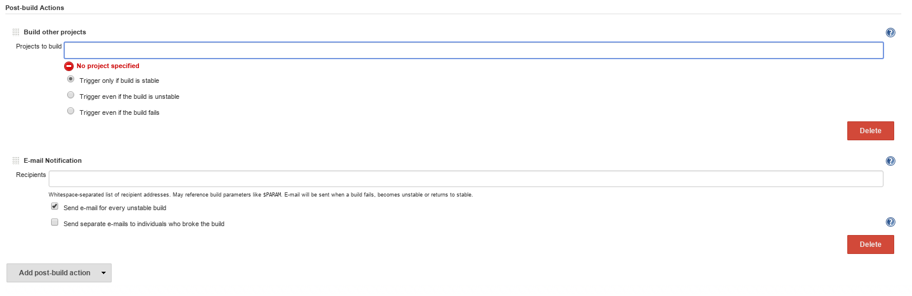

# Post-build steps {#jenkins_post_build_steps .concept}

There is set of predefined actions available in Jenkins to be triggered based on Jenkins job finish status.

-   **Build other project** - used to trigger another job based on current job finish status
-   **Email notification** - used to notify predefined users about the state of job

**Parent topic:**[Job anatomy](../../jenkins/job_anatomy/job_anatomy.md)

