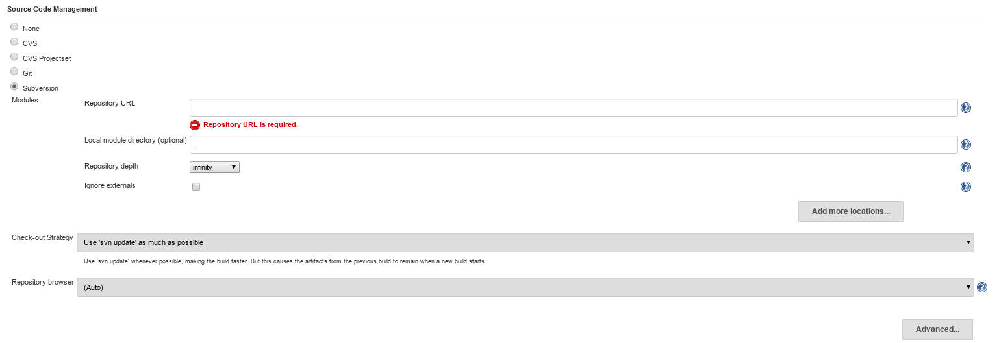
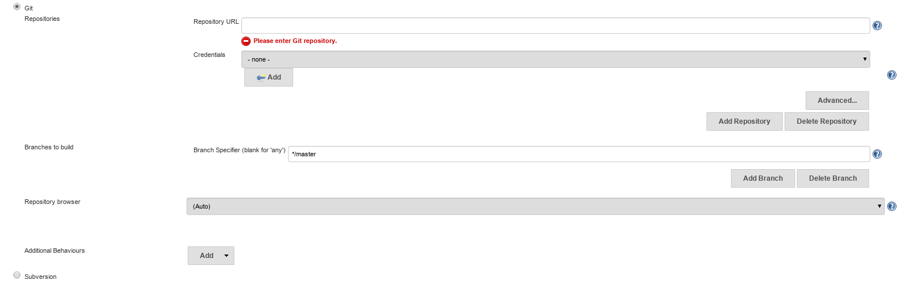

# Source code management {#be_events .concept}

*Source code management* section

-   is designed to fetch data from supported Data sources such as various Version control systems \(CVS,SVN,git etc.\)
-   number of available data sources depends on installed Jenkins plugins

All data related to job are saved in $JENKINS\_HOME/JOB\_NAME/workspace. JENKINS\_HOME location differs depending on target machine operation system and can be found in **Manage Jenkins -\> Configure system**

Note that other Data sources without Jenkins plugin available can be accessed via its CLI too. More information about this can be found in section Generic build steps of this chapter.

**Parent topic:**[Job anatomy](../../jenkins/job_anatomy/job_anatomy.md)

