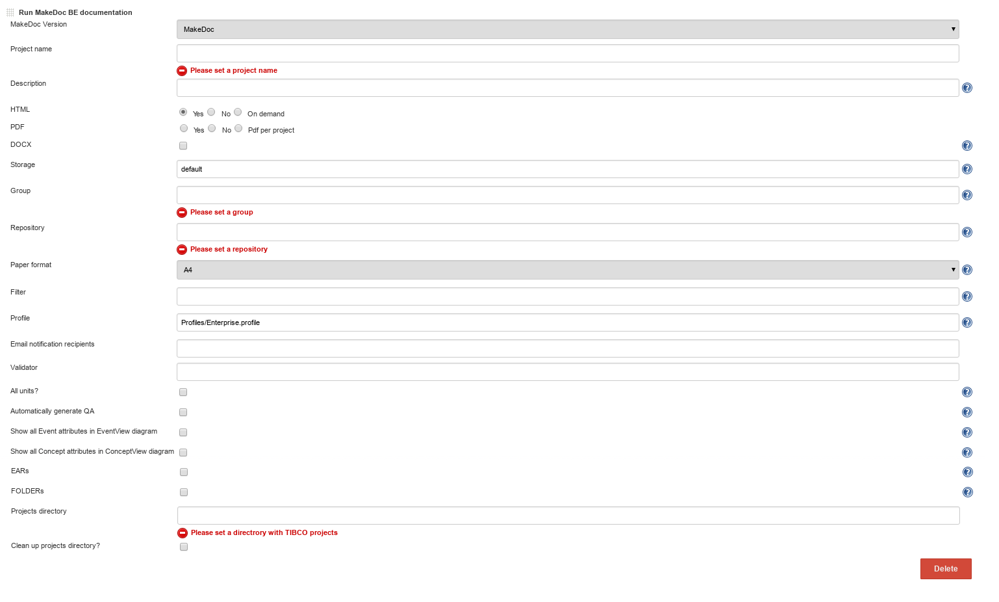

# BusinessEvents build step {#be_build_step .concept}

**Run BE documentation** step generates documentation for TIBCO BusinessEvents projects or deployments.

Run BE documentation parameters:

-   **Project name:** name used by core application
-   **Description:** short description \(used by core application\)
-   **HTML,PDF,DOCX:** generate this output format or not
-   **Storage:** storage to save generated output
-   **Group:** group generated documentation belongs to
-   **Repository:** repository generated documentation belongs to, see Chapter Portal for portal layers explanation
-   **Paper format:** A4 or Letter
-   **Filter:** allows to skip defined objects, for predefined filters see Filters chapter
-   **Profile:** profile to use, see Profiles chapter for default available profiles
-   **Validator:** ???
-   **Automatically generate QA:** generate QA report or not
-   **Show all Event attributes in EventView diagram:** if set to false, only first three attributes are shown
-   **Show all Concept attributes in ConceptView diagram:** if set to false, only first three attributes are shown
-   **Projects directory:** directory on MakeDoc server machine where MakeDoc resursively search for projects and deployments
-   **EARs:** include EARs to documentation process when seeking for sources in projects directory
-   **Folders:** include folders when seeking for sources in projects directory
-   **Use DTL:** include Design time libraries
-   **Cleanup Projects directory:** clean projects input directory after when documentation process finishes or not

**Parent topic:**[MakeDoc build steps](../../jenkins/md_build_steps/md_build_steps.md)

