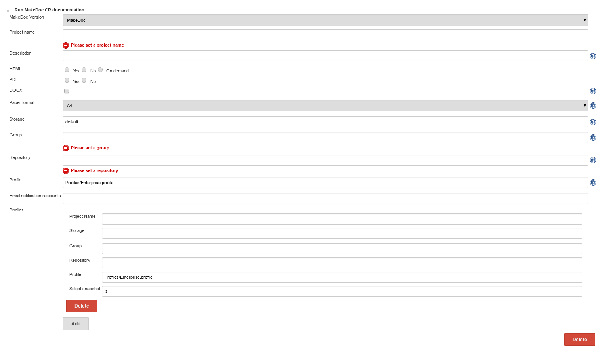

# CrossReference build step {#build_steps .concept}

**Run CrossReference documentation** step generates big CrossReference reports. CrossReference step uses generated output of other jobs \(or in fact MakeDoc documentation projects, being processed during documentation job run\).

Run CrossReference documentation parameters:

-   **Project name:** name used by core application
-   **Description:** short description \(used by core application\)
-   **HTML,PDF,DOCX:** generate this output format or not
-   **Storage:** storage to save generated output
-   **Group:** group generated documentation belongs to
-   **Repository:** repository generated documentation belongs to, see Chapter Portal for portal layers explanation
-   **Paper format:** A4 or Letter
-   **Profile:** profile to use, see Profiles chapter for default available profiles

To generate CrossReference report we need to add profiles to be analyzed using **Profiles** section of CR build step.

-   **Project name:** refers to project name
-   **Storage:** refers to storage where outputs are stored
-   **Group:** refers to group where outputs are stored
-   **Repository:** refers to repository where outputs are stored
-   **Profile:** refers to profile used in documentation job
-   **Select snapshot:** default is 0; this means last generated snapshot will be used in CrossReference report.

Notice: Project name/storage/group/repository/profile can be found in documentation job we would like generate CrossReference for.

**Parent topic:**[MakeDoc build steps](../../jenkins/md_build_steps/md_build_steps.md)

