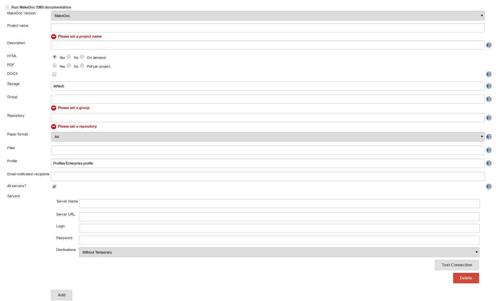

# EMS build step {#ems_build_step .concept}

**Run EMS documentation** step generates documentation for TIBCO EnterpriseMessageService.

Run EMS documentation parameters:

-   **Project name:** name used by core application
-   **Description:** short description \(used by core application\)
-   **HTML,PDF,DOCX:** generate this output format or not
-   **Storage:** storage to save generated output
-   **Group:** group generated documentation belongs to
-   **Repository:** repository generated documentation belongs to, see Chapter Portal for portal layers explanation
-   **Paper format:** A4 or Letter
-   **Filter:** allows to skip defined objects, for predefined filters see Filters chapter
-   **Profile:** profile to use, see Profiles chapter for default available profiles

Next step is to add all EMS servers we would like to document:

-   **Server name:** server name for core application, mostly the same as the server domain name
-   **Server URL:** \[tcp\|ssl\]://server:port
-   **Login:** user name allowed to log in
-   **Password:** user password

**Parent topic:**[MakeDoc build steps](../../jenkins/md_build_steps/md_build_steps.md)

