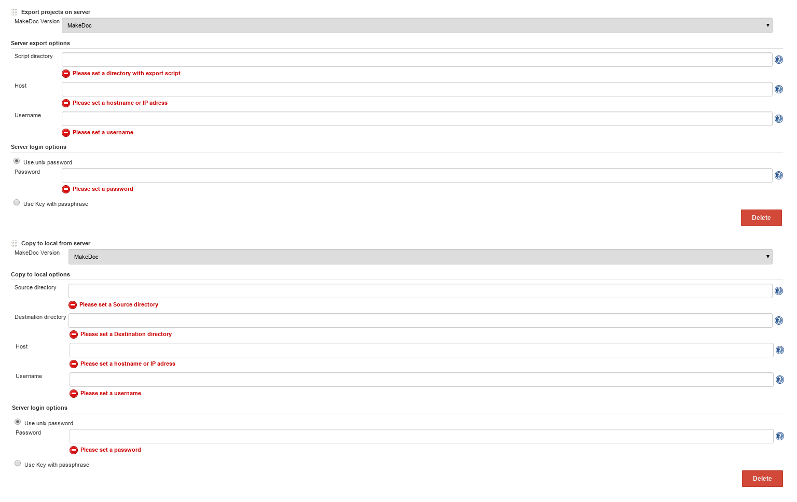

# Production data fetching steps {#production_data_fetching_step .concept}

Production data fetching steps transfer deployments from production server to MakeDoc server. This process has two phases:

-   **Export projects on server** - this step exports deploymets to predefined location on production server using TIBCO AppManage
-   **Copy to local** - copies these deployments to MakeDoc server

These steps are usually followed by

-   **Run BW documentation from server** - documents BW deployments including configuration \(reads AppManage.batch\), see Run BW documentation from server

Following picture shows both mentioned steps.

Export project on server parameters:

-   **Host:** machine where TIBCO Administrator is running
-   **User:** user allowed to run AppManage
-   **Password:** password for user who is allowed to run AppManage
-   **Script directory:** directory where export script is stored \(script delivered with MakeDoc server\)

Copy to local parameters \(Host,User,Password are the same as for export step\)

-   **Source directory:** directory with exported deployments on TIBCO machine
-   **Destination directory:** where to store exported deployments on MakeDoc server machine

**Parent topic:**[MakeDoc build steps](../../jenkins/md_build_steps/md_build_steps.md)

