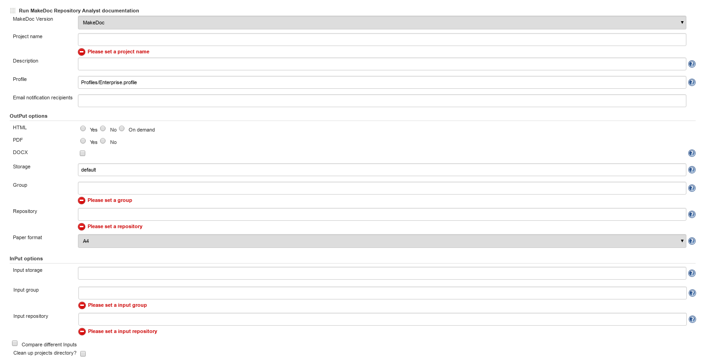

# RepositoryAnalyst build step {#ra_build_step .concept}

**Run RepositoryAnalyst documentation** step generates delta reports which highlight changes made between two generation runs. RepositoryAnalyst step uses output of other documentation job similar as CrossReference step.

Run RepositoryAnalyst documentation parameters:

-   **Project name:** name used by core application
-   **Description:** short description \(used by core application\)
-   **Profile:** profile to use, see Profiles chapter for default available profiles

Output options \(output format and generated report location in MakeDoc portal - where report can be found as generation process finishes\)

-   **HTML,PDF,DOCX:** generate this output format or not
-   **Storage:** storage to save generated output
-   **Group:** group generated documentation belongs to
-   **Repository:** repository generated documentation belongs to, see Chapter Portal for portal layers explanation
-   **Paper format:** A4 or Letter

Input options \(determines which repository is used for comparison - by storage/group/repository\), last two records in repository are used for comparison

-   **Project name:** name used by core application
-   **Description:** short description \(used by core application\)
-   **HTML,PDF,DOCX:** generate this output format or not
-   **Storage:** storage to save generated output
-   **Group:** group generated documentation belongs to
-   **Repository:** repository generated documentation belongs to, see Chapter Portal for portal layers explanation
-   **Paper format:** A4 or Letter

**Parent topic:**[MakeDoc build steps](../../jenkins/md_build_steps/md_build_steps.md)

