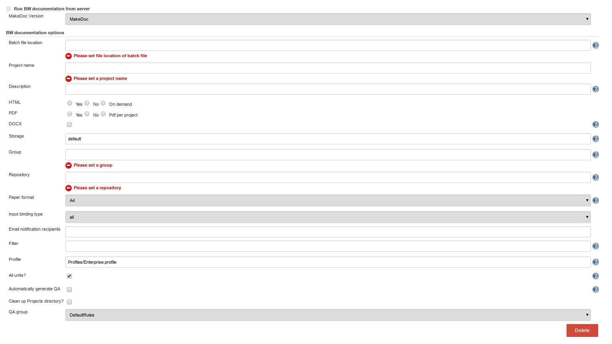

# BusinessWorks production deployments step {#remote_bw_build_step .concept}

BusinessWorks production deployments step is designed to document production deployments including productional configuration. Usually **Export projects on server** and **Copy to local** steps are invoked before calling this step. To document deployments including configuration, choose Build step **Run BW documentation from server**. Before starting documentation process this step reads AppManage.batch file.

Run BW documentation from server parameters:

-   **Batch file location:** location on MakeDoc server machine where AppManage.batch file is stored
-   **Project name:** project name \(used by core application\)
-   **Description:** short description \(used by core application\)
-   **HTML,PDF,DOCX:** generate this output format or not
-   **Storage:** storage to save generated output
-   **Group:** group generated documentation belongs to
-   **Repository:** repository generated documentation belongs to, see Chapter Portal for portal layers explanation
-   **Paper format:** A4 or Letter
-   **Input bindings type:** all, table, tree, raw \(various ways how to display input bindings, see\)
-   **Filter:** allows not to document defined objects, predefined filters, see Filters chapter for default available filters
-   **Profile:** profile to use when generating documentation, see Profiles chapter for default available profiles
-   **Automatically generate QA:** generate QA report or not
-   **Cleanup Projects directory:** clean projects input directory after when documentation process finishes or not

**Parent topic:**[MakeDoc build steps](../../jenkins/md_build_steps/md_build_steps.md)

