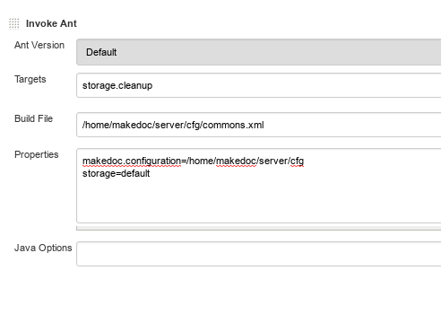

# Cleaning {#storage_cleaning .concept}

This chapter describes MakeDoc storage maintenance. Storage cleaning means deleting of incomplete and old snapshots. This functionality can be invoked via standard ant script as shown on images bellow.

")

**Parent topic:**[Storage](../storage/storage.md)

