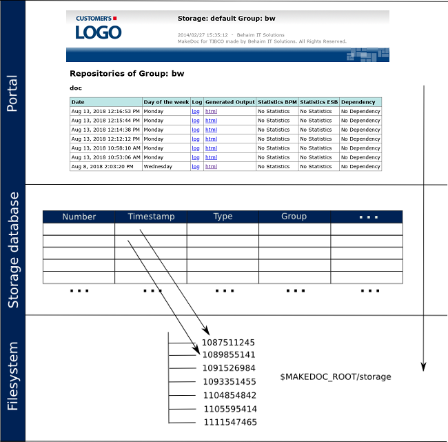

# Purpose {#storage_description .concept}

As we already know, MakeDoc automatically generates documentation. One documentation generated from set of sources in certain time is called **snapshot**. If we generate the documentation again we will get another snapshot as the result of documentation run. Snapshots are saved on the filesystem.

**MakeDoc storage** is database which contains records related to snapshots generated in the past, their results etc. - all information needed to manage data produced by MakeDoc.

Storage data are used to generate MakeDoc portal.

Following figure shows relationship between portal, storage database and snapshots.

**Parent topic:**[Storage](../storage/storage.md)

