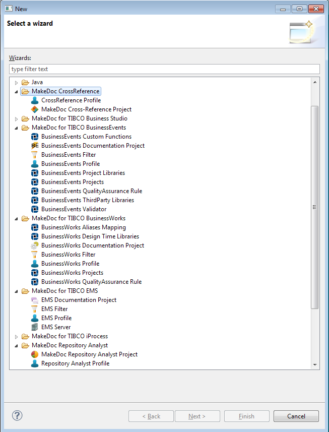

# Wizards {#BaseModule .concept}

Every installed MakeDoc module has unique sets of objects that can compose its project. These objects are either projects or files within the projects. There is create wizard for each object.

Once wizard is finished object is added into project.

**Parent topic:**[Common GUI Principles](../../../modules/base/gui/index.md)

