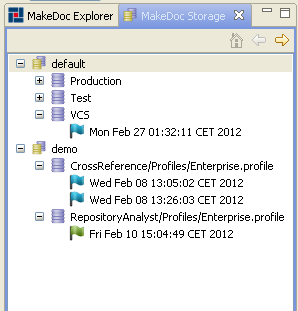

# GUI {#StorageGUI .concept}

Storage GUI is available upon startup as a stand-alone tab.

It displays on the first level storages available on system. The second level shows Repositories. Records are displayed on last level.

If Storage GUI is not visible go to Window-\>Show View-\>Other select MakeDoc-\>Storage.

It provides following functionality:

-   **Browse generated outputs.** Generated documentation/logs/folders can be accessed via right-\>click menu or through buttons.
-   **Regenerate outputs.** You can regenerate formats of the given snapshot.
-   **Delete generated outputs.** Generated documentation \(outputs\) can be deleted via right-\>click menu. Several records can be selected by holding Shift or Ctrl button, these records can be also deleted together. Or all groups or repositories can be deleted via context menu.
-   **Clean storage.** Storage can get into inconsistent state due to manual or administrative tasks. I.e. deletion of some records directly on disk. In this case it is necessary synchronized internal SQL database against disk directory. This can take a while on large installations.

**Parent topic:**[Storage](../../../modules/base/storage/index.md)

