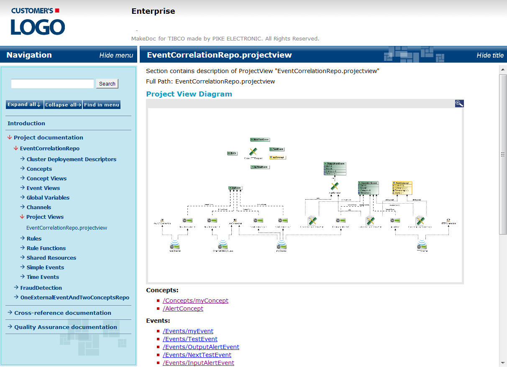

# Project Documentation {#BebeProjectDoc .concept}

The Project documentation contains chapter for each documented project. The focus of this chapter is on message and data processing. A project documentation may contains some or all of sections depending on BusinessEvents Profile settings.

-   **[Supported Resources](../../../modules/bebe/output/SupportedResources.md)**  

-   **[Cluster Deployment Descriptors](../../../modules/bebe/output/cdd.md)**  

-   **[Concepts](../../../modules/bebe/output/Concept.md)**  

-   **[Concept Views](../../../modules/bebe/output/ConceptView.md)**  

-   **[Event Views](../../../modules/bebe/output/EventView.md)**  

-   **[Global Variables](../../../modules/bebe/output/GV.md)**  

-   **[Channels](../../../modules/bebe/output/Channel.md)**  

-   **[Project Views](../../../modules/bebe/output/ProjectView.md)**  

-   **[Rules](../../../modules/bebe/output/Rule.md)**  

-   **[Rule Functions](../../../modules/bebe/output/RuleFunction.md)**  

-   **[Scorecards](../../../modules/bebe/output/Scorecard.md)**  

-   **[Shared HTTP Connection](../../../modules/bebe/output/SharedHTTPConnection.md)**  

-   **[Shared JMS Connection](../../../modules/bebe/output/SharedJMSConnection.md)**  

-   **[Shared JNDI Configuration](../../../modules/bebe/output/SharedJNDIConfiguration.md)**  

-   **[Simple Events](../../../modules/bebe/output/SimpleEvent.md)**  

-   **[Time Events](../../../modules/bebe/output/TimeEvent.md)**  

-   **[State Machines](../../../modules/bebe/output/StateMachine.md)**  

**Parent topic:**[Generated Output](../../../modules/bebe/output/index.md)

