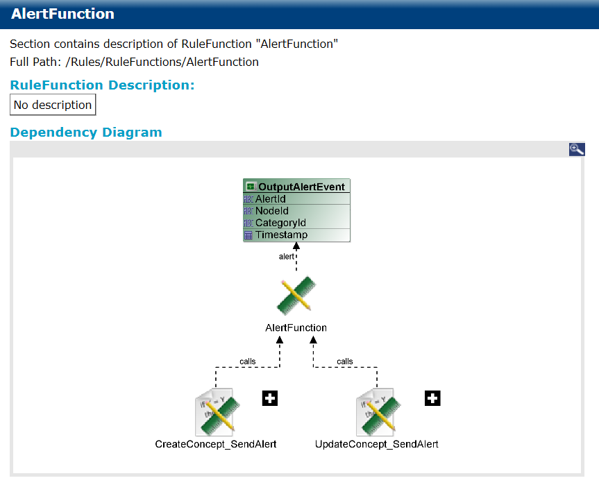

# Rule Functions {#rulefunctions .concept}

Rule Function documentation consists of Rule Description, Dependency Diagram, Sequence Diagram, Virtual, Validity, Return Type, Scope, Body.

**Parent topic:**[Project Documentation](../../../modules/bebe/output/ProjectDocumentation.md)

