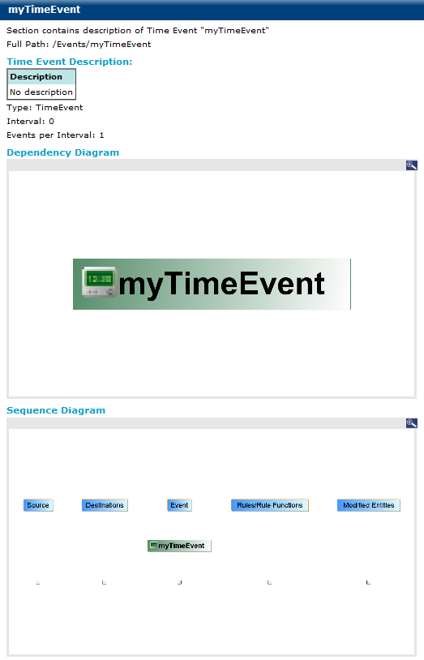

# Time Events {#timeEvent .concept}

Time Event documentation consists of Time Event Description, Dependency Diagram, Sequence Diagram.

**Parent topic:**[Project Documentation](../../../modules/bebe/output/ProjectDocumentation.md)

