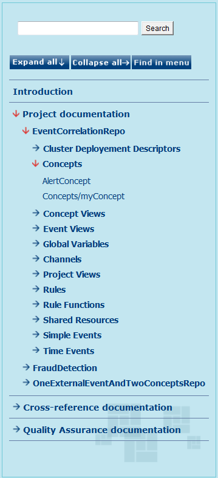

# Generated Output {#BaseModule .concept}

Documentation can be generated in HTML, PDF and DOCX format \(depends on licensed products\). Each HTML document contains a tree navigation divided into three main parts - Project Documentation, Cross-reference Documentation and Quality Assurance Documentation. HTML contains Quality Assurance Documentation only if Quality Assurance Module is licensed. The Project Documentation part contains list of projects and each project contains all its resources. Navigation items are links to HTML documents and the menu is updated according to actually displayed content. The PDF format of documentation has bookmarks which are similar in structure to the HTML navigation. The DOCX documentation is another printable file format, which is also easy to edit and format.

-   **[Project Documentation](../../../modules/bebe/output/ProjectDocumentation.md)**  

-   **[Cross-Reference Documentation](../../../modules/bebe/output/CrossReferenceDocumentation.md)**  

-   **[Quality Assurance Documentation](../../../modules/bebe/output/QADocumentation.md)**  

**Parent topic:**[TIBCO BusinessEvents Module](../../../modules/bebe/index.md)

