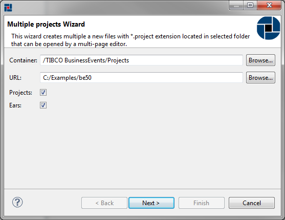

# Creating TIBCO BusinessEvents project {#creatingBEProject .concept}

TIBCO BusinessEvents project can be created by New Multiple BusinessEvents Projects wizard. New Multiple BusinessEvents Projects wizard allows create more TIBCO BusinessEvents projects by one step.

**Creating multiple BusinessEvents projects**

Right click on Project folder in TIBCO BusinessEvents Module project and select New \> BusinessEvents Project

New Multiple BusinessEvents Projects wizard allows selection of desired type of source - Folders and EARs. After setting URL to directory, wizard tries to find all sources in selected folder recursively and shows all found TIBCO BusinessEvents Projects for selecting or deselecting found projects.

**Parent topic:**[Working with TIBCO BusinessEvents projects](../../../../modules/bebe/setup/dialogs/workingWithBEProject.md)

