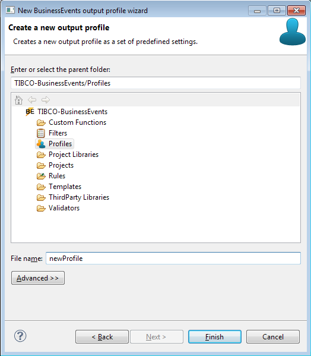

# Creating BusinessEvents Profiles {#creatingBEProfile .concept}

BusinessEvents Profiles can be created by BusinessEvents Profile wizard. To open BusinessEvents Profile wizard right-click on folder Profiles and select New \> BusinessEvents Profile.

First page allow select predefined type of Profile:

-   Enterprise - in default generates all outputs
-   Printable - in default generates only PDF output
-   QA Only - in default generates only QA output

On next page is possible select destination folder of created Profile and set name of new Profile.

Wizard creates new Profile in selected folder after pressing Finish button.

**Parent topic:**[Working with Profiles](../../../../modules/bebe/setup/dialogs/workingWithProfile.md)

