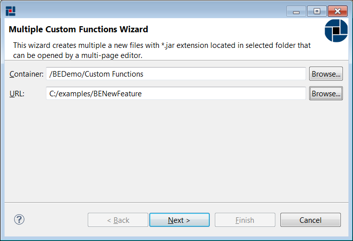
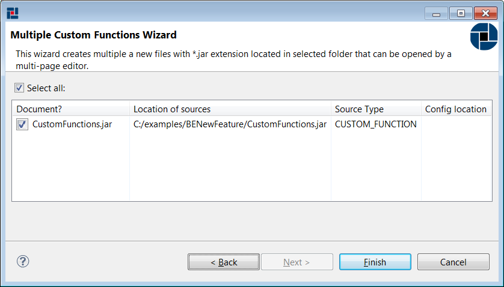
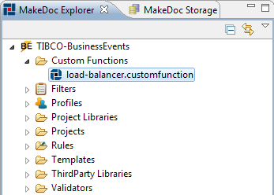
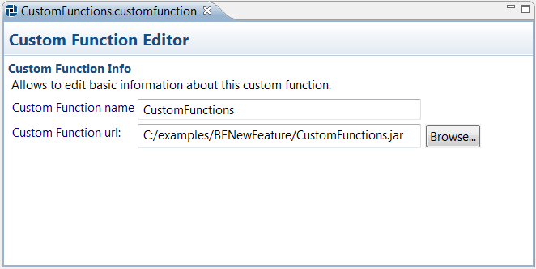

# Working with Custom Functions {#BEBEModule .concept}

MakeDoc is able to document TIBCO BusinessEvents Custom Functions. Custom Functions are \*.jar files, that contains customer functions which are used in BE project. In this chapter we will go through Custom Function setup. As well as other resources custom function is represented by file. To document custom function we have to add custom function resource to our documentation project. Process of adding custom function is very similar to project creation. It holds wizard-editor fashion and offers batch custom function files creation too.

To add Custom Functions files click right-click on Custom Functions folder in MakeDoc Explorer and run New-\>BusinessEvents Custom Functions. MakeDoc starts Custom Functions files creation wizard. Click Browse and navigate to the folder you would like to recursively search Custom Functions for. In this example it is C:/example/BENewFeature.

First page allow set location of Custom Functions \(\*.jar\): On the next page is possible select Custom Functions from folder selected in URL.

Click Finish to add Custom Functions to our project. MakeDoc Explorer now should look like this:

To edit Custom Functions settings just click on corresponding file and Custom Functions Editor is opened immediately.

**Parent topic:**[Dialogs](../../../../modules/bebe/setup/dialogs/dialogs.md)

