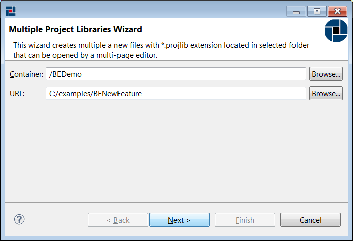
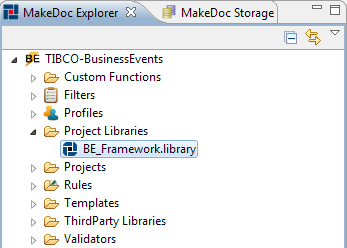

# Working with Project Libraries {#BEBEModule .concept}

MakeDoc is able to document TIBCO BusinessEvents Project Libraries. In this chapter we will go through project library setup. As well as other resources project library is represented by file. To document project library we have to add project library resource to our documentation project. Process of adding project library is very similar to project creation. It holds wizard-editor fashion and offers batch project library files creation too.

To add Project Libraries files click right-click on Project Libraries folder in MakeDoc Explorer and run New-\>BusinessEvents Project Libraries. MakeDoc starts Project Libraries files creation wizard. Click Browse and navigate to the folder you would like to recursively search Project Libraries for. In this example it is C:/example/BENewFeature.

MakeDoc will now search for Project Libraries in selected folder. By default all detected libraries are selected for addition.

Click Finish to add Project Libraries to our project. MakeDoc Explorer now should look like this:

To edit Project Library settings just click on corresponding file and Project Library Editor is opened immediately.

**Parent topic:**[Dialogs](../../../../modules/bebe/setup/dialogs/dialogs.md)

