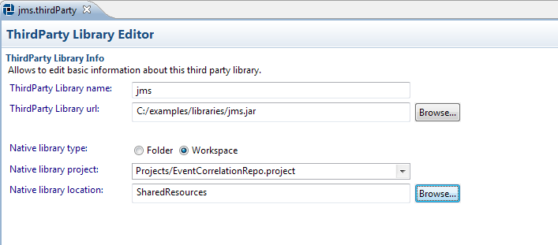

# Working with ThirdParty Libraries {#BEBEModule .concept}

MakeDoc is able to document TIBCO BusinessEvents ThirdParty Libraries. ThirdParty Libraries are \*.jar files, that contains third-party libraries which are used in BE project. In this chapter we will go through ThirdParty Libraries setup. As well as other resources thirdParty library is represented by file. To document thirdParty library we have to add thirdParty library resource to our documentation project. Process of adding thirdParty library is very similar to project creation. It holds wizard-editor fashion and offers batch thirdParty library files creation too.

To add ThirdParty Libraries files click right-click on ThirdParty Libraries folder in MakeDoc Explorer and run New-\>BusinessEvents ThirdParty Libraries. MakeDoc starts ThirdParty Libraries files creation wizard. Click Browse and navigate to the folder you would like to recursively search ThirdParty Libraries for. In this example it is C:/examples/libraries.

First page allow set location of ThirdParty Libraries \(\*.jar\): On the next page is possible select ThirdParty Libraries from folder selected in URL.

Click Finish to add ThirdParty Libraries to our project. MakeDoc Explorer now should look like this:

To edit ThirdParty Libraries settings just click on corresponding file and ThirdParty Libraries Editor is opened immediately.

**Parent topic:**[Dialogs](../../../../modules/bebe/setup/dialogs/dialogs.md)

