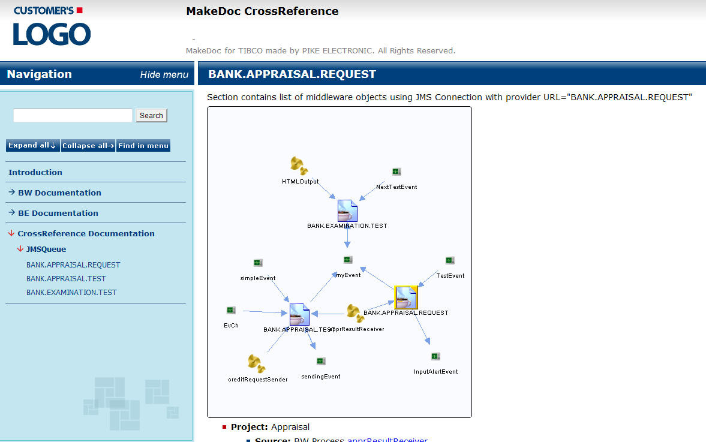

# Generated Output {#BaseModule .concept}

Documentation can be generated in HTML, PDF and DOCX format. Each HTML document contains a tree navigation. Navigation items are links to HTML documents and the menu is updated according to actually displayed content. The PDF documentation has bookmarks which are similar in structure to the HTML navigation. The DOCX documentation is another printable file format, which is also easy to edit and format.

Output of CrossReference documentation contains several main subsections: documentations of projects selected in CrossReference **\(it can be BW, BE, BPM or EMS Documentation\)** and **CrossReference Documentation**.

-   **[CrossReference Documentation](../../../modules/crusader/output/CrossReferenceDocumentation.md)**  

**Parent topic:**[CrossReference Module](../../../modules/crusader/index.md)

