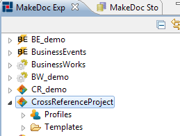

# Create a new CrossReference project {#BaseModule .concept}

-   In menu select File -\> New -\> **CrossReference Documentation Project**.
-   Type name of CrossReference Documentation Project
-   Click **Finish**

A new CrossReference Documentation project will be created and displayed in MakeDoc Explorer.

A CrossReference Documentation project contains two folders:

-   *Profiles* - Here are stored defined profiles of CrossReference Documentation. There are 2 default Profiles - Enterprise and Printable. Each profile has predefined settings for formatting output documentation.
-   *Templates* - Here are templates for formatting the output of CrossReference Documentation.

-   **[Create a new CrossReference profile](../../../modules/crusader/setup/createNewCRProfile.md)**  

**Parent topic:**[Setup](../../../modules/crusader/setup/index.md)

