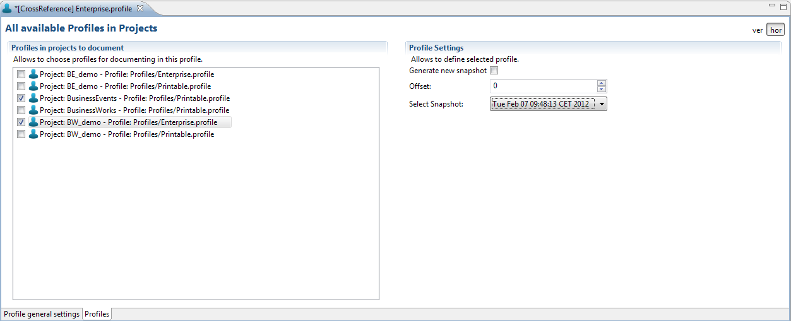

# Select Profiles {#BaseModule .concept}

On the left side of editor is the list of all possible profiles in projects in MakeDoc's workspace. You can check which profiles you want to document in CrossReference.

After click on some of profiles, on the right side are displayed settings of the concrete profile. Settings of profile contains:

-   *Generate New Snapshot* checkbox. If checked, a new snapshot of this profile is documented.
-   *Offset* - type number of offset to select existing snapshot. 0 is the last generated snapshot, -1, -2, ... are older snapshots.
-   *Select Snapshot* - allows to select concrete snapshot.

**Parent topic:**[Setup CrossReference Profile](../../../modules/crusader/setup/setupCRProfile.md)

