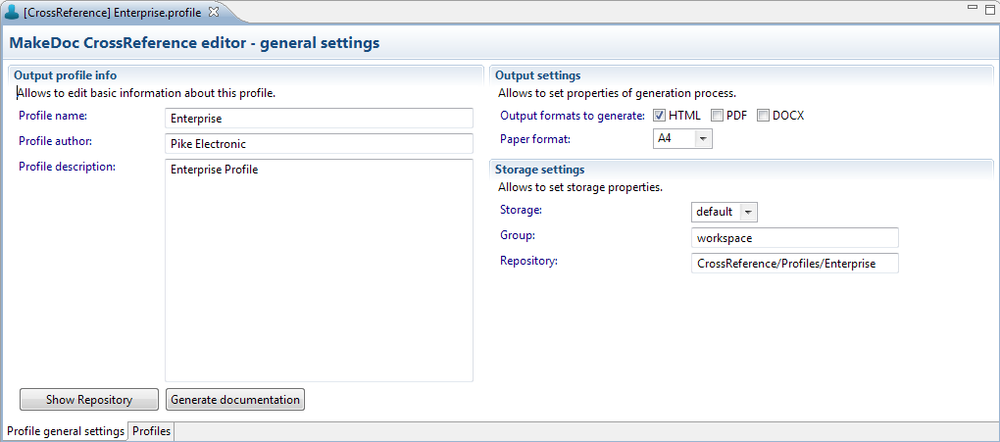

# Setup CrossReference Profile {#BaseModule .concept}

Profile Editor has 2 pages:

-   *Profile general settings* - general settings
-   *Profiles* - select profiles to document

General settings page allows:

-   start documentation process
-   set output format - HTML, PDF, DOCX
-   set paper format
-   set Storage setting - Storage, Repository location

-   **[Select Profiles](../../../modules/crusader/setup/selectProfiles.md)**  

**Parent topic:**[Setup](../../../modules/crusader/setup/index.md)

