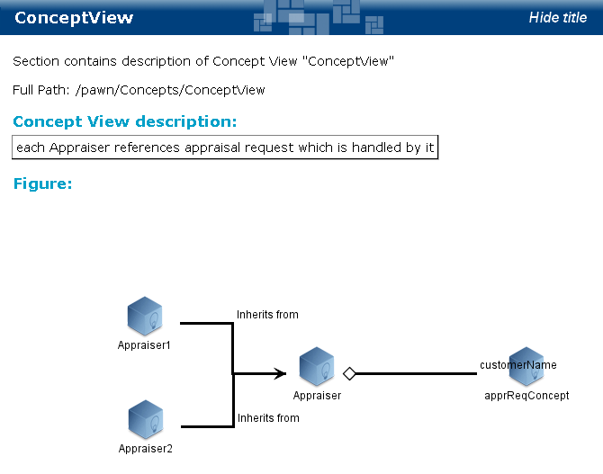

# BE Concept Views {#BEConceptviews .concept}

BE concept views documentation consists of description, figure and concepts.

**Parent topic:**[Project Documentation](../../../modules/falcon/output/projectDoc.md)

