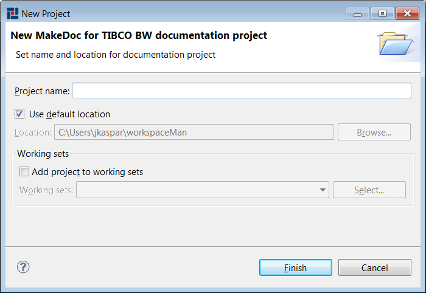

# Setup {#BaseModule .concept}

This chapter provides step-by-step tutorial how to automatically generate documentation for TIBCO BusinessWorks integration projects by the help of MakeDoc for TIBCO BusinessWorks \(BW\) module. In this chapter some terms defined in previous chapters are used.

To successfully generate TIBCO BusinessWorks documentation we need to create instance of MakeDoc for TIBCO Business Works project. To do so go to File -\> New -\> Other or use shortcut Ctrl+N. Then expand MakeDoc for TIBCO Business Works folder and choose MakeDoc for TIBCO Business Works documentation project.

MakeDoc shows wizard which helps us to create our MakeDoc BW documentation project. We need to provide project name and click Finish. This name distinguish this project from other created projects.

MakeDoc will now create BW documentation project with basic structure.

Remember that MakeDoc uses file-based philosophy. Almost every element in MakeDoc terminology is represented by a file.

These elements are:

-   **Project \(.project\)** - represents one integration project \(in this case one TIBCO BW project\), term documentation unit can be used too in next paragraphs.
-   **Library \(.library\)** - optional, represents one TIBCO BW Design time library \(DTL\)
-   **Aliases \(.aliases\)** - optional, represents alias to DTL mapping. More than one alias can be mapped to one DTL.
-   **Profile \(.profile\)** - uses all previously defined elements to define one specific MakeDoc for TIBCO BW run.

Note: folder "Templates" contains XSL templates and other files needed to generate documentation for TIBCO BW. By editing these templates user can influence final appearance of generated documentation. Purposes of folders Filters and Rules are explained in other parts of this user manual.

For every type of file corresponding folder is created. It is recommended to use corresponding folders for files but it is not necessary.

In following parts we will create all these elements to successfully generate our documentation.

-   **[Working with projects](../../../modules/falcon/setup/project.md)**  

-   **[Working with design time libraries and aliases](../../../modules/falcon/setup/library.md)**  

-   **[Working with profiles](../../../modules/falcon/setup/profile.md)**  

**Parent topic:**[TIBCO BusinessWorks Module](../../../modules/falcon/index.md)

