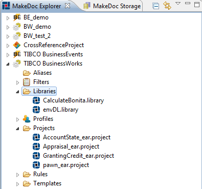
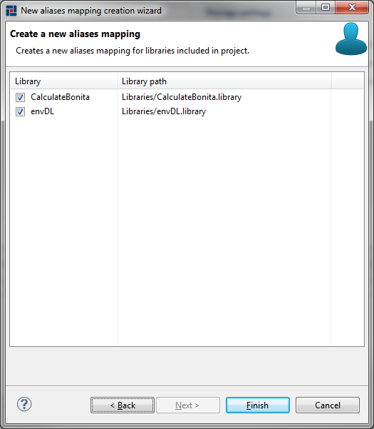
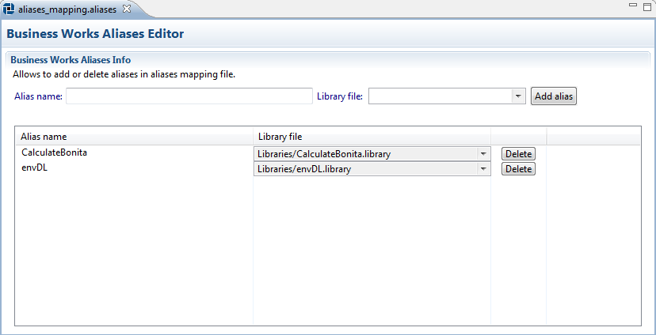

# Working with design time libraries and aliases {#BaseModule .concept}

MakeDoc is able to document TIBCO BusinessWorks design time libraries. In this chapter we will go through DTL setup. As well as other resources DTL is represented by file. To document DTL we have to add DTL resource to our documentation project. Process of adding DTL is very similar to project creation. It holds wizard-editor fashion and offers batch DTLs files creation too.

To add DTLs files click right-click on Libraries folder in MakeDoc Explorer and run New-\>BusinessWorks Design Time Libraries. MakeDoc starts DTLs files creation wizard. Click Browse and navigate to the folder you would like to recursively search DTLs for. In this example it is C:/Examples/bw.

MakeDoc will now search for DTLs in selected folder. By default all detected libraries are selected for addition.

Click Finish to add DTLs to our project. MakeDoc Explorer now should look like this:

To edit DTL settings just click on corresponding file and DTL editor is opened immediately.

To successfully document DTLs we need to do one more step - define alias-to-library mapping. It's the same as in previous parts, MakeDoc has pair wizard-editor for this task. Go to MakeDoc Explorer, open context menu for Aliases folder and run New-\>BusinessWorks Aliases Mapping. On the first page enter file name for newly created aliases mapping file. Aliases file has extension .aliases but there is no need to enter it, MakeDoc adds it for you automatically. Click Next.

Next page shows simple default mapping. By default alias has the same name as library file alias is mapped to.

If this not meet user's requirements there is an editor provided. This editor is opened when user clicks on aliases mapping file. By the help of this editor it is possible to fine-tune aliases mapping. It is possible to add new alias, delete it, change name of alias or change library file it is mapped to. Dropdown-lists are pre-filled with all the DTLs our project consist of.

**Parent topic:**[Setup](../../../modules/falcon/setup/index.md)

