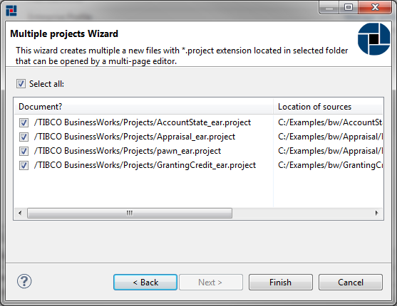
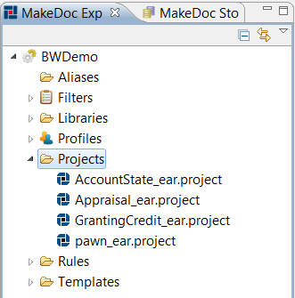

# Working with projects {#BaseModule .concept}

Integration projects are in MakeDoc represented by files with .project extension in general. Let's create some of these files. We can create more .project files in one step in batch manner.

At first try to create one .project file. We can create it by adding source folder or deployment file. Right-click on Projects folder in MakeDoc Explorer and choose New-\>BusinessWorks project.

Because adding units one by one is not effectively in most cases, MakeDoc can add multiple units in one step for you. For this purpose New Multiple BusinessWorks projects wizard was designed. Right-click on Projects and choose New-\>BusinessWorks projects. Navigate to $\{MAKEDOC\_HOME\}/demo/tibco/input/1/bw. MakeDoc will search for all TIBCO BW Projects stored in this folder. It is possible to search for:

-   source folders
-   deployments
-   both - folders and deployments

Let's say that we would like to add deployments only so uncheck "Projects" and click Next. Wizard automatically detects deployments configurations if there is configuration file with same name in folder with target deployment.

Click Finish to add all deployment files. Projects folder now contains four items as shows following image.

So we have successfully added new units we need to document. To be able to change configuration of existing projects MakeDoc provides project editor. This editor starts when .project file is clicked.

**Parent topic:**[Setup](../../../modules/falcon/setup/index.md)

