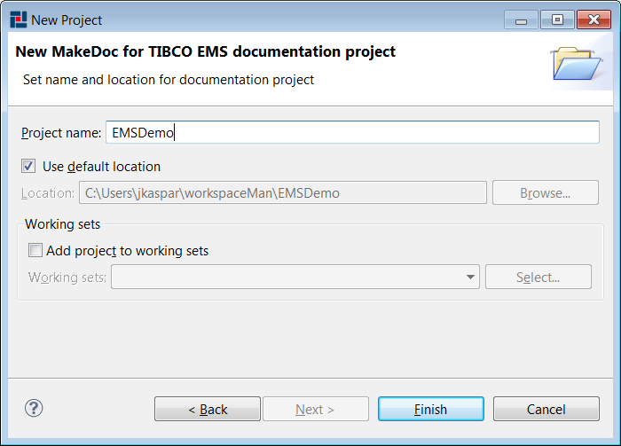
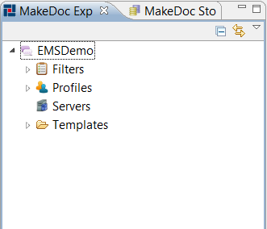

# Creating TIBCO EMS Module Project {#creatingEMSModulProject .concept}

Chapter describes creation of TIBCO EMS Module project.

Name of project can be set in next wizard page.

MakeDoc creates main project structure after pressing Finish.

Project contains four folders:

-   Filters - contains filters for reducing generated documentation
-   Profiles - contains profiles for selecting TIBCO EMS servers to document, output format of documentation
-   Servers - contains all TIBCO EMS servers to document
-   Templates - contains FreeMarker templates

**Parent topic:**[Dialogs](../../../../modules/pigeon/setup/dialogs/dialogs.md)

