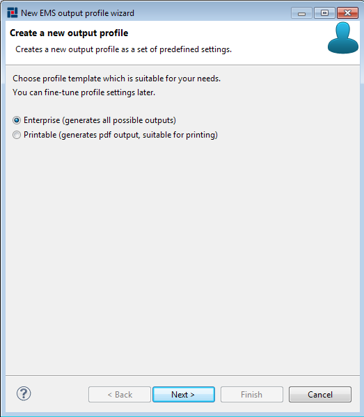

# Creating EMS Profiles {#creatingBSProfile .concept}

EMS Profiles can be created by EMS Profile wizard. To open New EMS Profile wizard right-click on folder Profiles and select New \> EMS Profile.

First page allows to select one of the predefined Profile types:

-   Enterprise - in default generates all outputs
-   Printable - in default generates only PDF output

On the next page is possible select destination folder of created Profile and set name of new Profile.

Wizard creates new Profile in selected folder after pressing Finish button.

**Parent topic:**[Working with Profiles](../../../../modules/pigeon/setup/dialogs/workingWithProfile.md)

