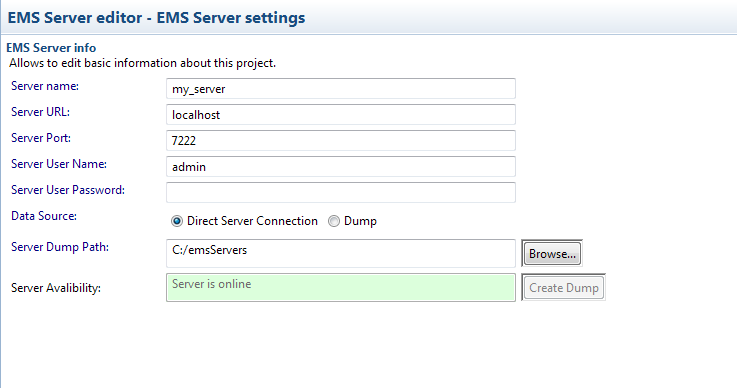

# Editing EMS server {#editingIPProject .concept}

Existing EMS Servers can be modified by EMS Server Editor. Editor allows change connection info items of EMS Server.

**Parent topic:**[Working with TIBCO EMS servers](../../../../modules/pigeon/setup/dialogs/workingWithEMSServer.md)

