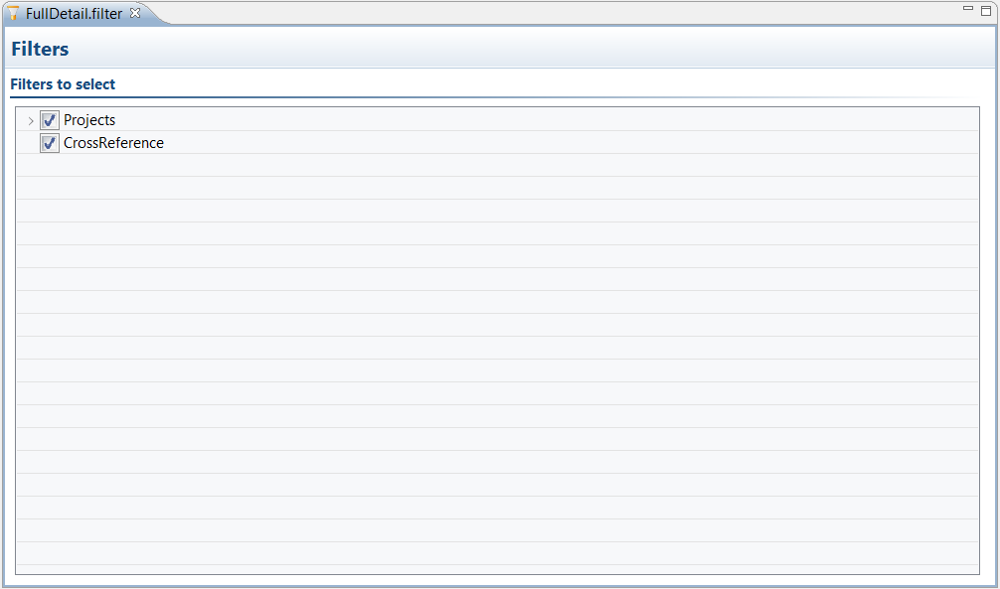

# Editing filters {#editingFilters .concept}

Existing filters can be modified by EMS Filter Editor. Filter allows reduce generated documentation by selecting parts showed in EMS Filter Editor.

Filter contains two parts. Projects and CrossReference. By deselecting parts is possible reduce generated documentation.

**Parent topic:**[Working with Filters](../../../../modules/pigeon/setup/dialogs/workingWithFilters.md)

