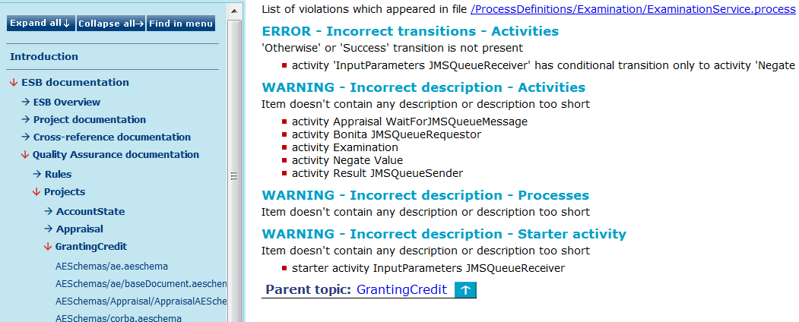

# Quality Assurance over Projects {#BaseModule .concept}

Chapter describes contents of generated output within the Quality Assurance module from the point of view of projects. This menu item uncovers you a list of all projects where at least one rule was violated. Once you click on a concrete project's object displayed in this list you are able to see all rules violated on this item.

**Parent topic:**[Generated Output](../../../modules/qa/output/index.md)

