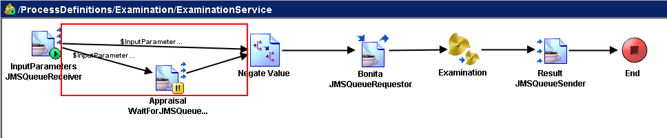

# ActivityTransitionsRuleChecker {#ActivityTransitionsRuleChecker .concept}

Groups of preconfigured ActivityTransitionsRuleChecker types of rules with instance distinction and violation description:

-   **Incorrect transitions** - 'Otherwise' or 'Success' transition is not present
    -   Activities

This type of rule allows to check whether correct transitions are used from activity. This can be assured by presence of otherwise type of transition \(when conditionals are present\) or simple success transition. Example in picture above shows that only transitions with conditional expression leads from start activity, therefore the violation was discovered.

**Parent topic:**[Rule types description](../../../modules/qa/setup/qualityAssuranceRuleTypesDescription.md)

