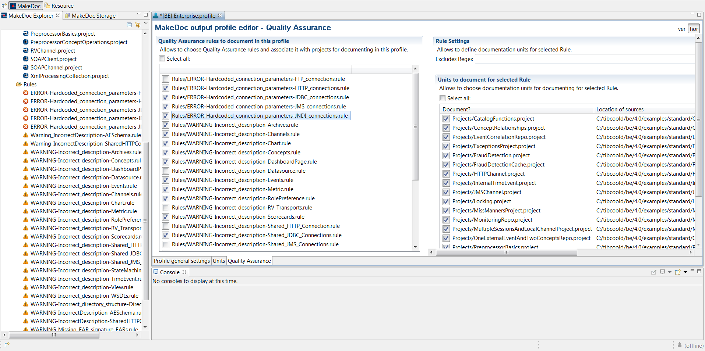

# Quality Assurance Dialog {#qualityAssuranceDialog .concept}

**Note:** This dialog is available only if you have purchased product Quality Assurance.

This dialog is used for settings of Quality Assurance module. It is possible to choose which rules will be used during Quality Assurance check. The rule is classified by its group, type and name \(this combination has to be unique within solution\). Chapter also reflects output chapter in documentation and rule's topic group.

It can be opened by clicking on Quality Assurance tab within the **Profile Editor**.

There are some options how to work with rules on this page - you can select project to check and assign concrete rules to selected project \(to apply them to the project within a QA check\).

-   1. Enable Rule - check the checkbox belonging to a required rule \(a row in the left "Quality Assurance rules to document in this profile" panel\)
-   2. Assign project to a rule desired to check - select a rule in the left hand side panel and choose projects by using check boxes in the right hand side panel \(Units to document for selected Rule\)

**Parent topic:**[Working with Rules](../../../modules/qa/setup/workingWithRules.md)

