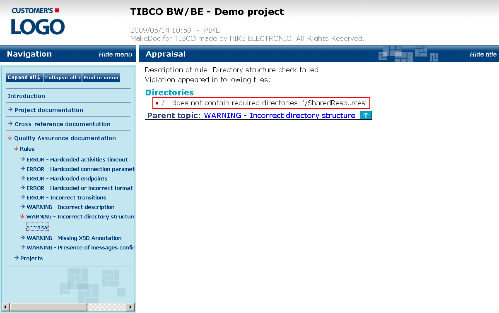

# DirectoryStructureRuleChecker {#DirectoryStructureRuleChecker .concept}

Groups of preconfigured DirectoryStructureRuleChecker types of rules with instance distinction and violation description:

-   **Incorrect directory structure** - Directory structure check failed
    -   Directories

This type of rule allows to check whether the directory structure of project is followed as specified. Example in picture above shows missing SharedResources folder in project \(SharedJMSResources folder is used instead\).

It is possible to define required and forbidden paths in configuration section.

**Parent topic:**[Rule types description](../../../modules/qa/setup/qualityAssuranceRuleTypesDescription.md)

