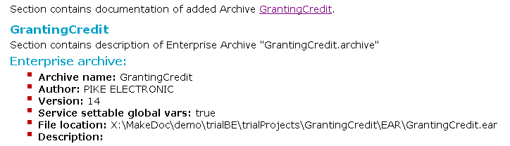
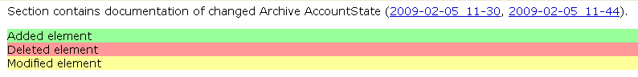

# Repository Analyst {#repositoryAnalyst .concept}

Repository analyst documentation can be generated in HTML and PDF format. Document is divided into three main parts - **Added** items, **Removed** items and **Changed** items. Everyone of these parts corresponds to adequate repository changes - added represents added files, removed deleted files from file system and changed represents files of same name whose structure was modified. Each section contains also summary of numbers of adequate file's change.

Inner tree structure of these three parts is similar to structure used in Project and Cross-reference documentation.

Sections added items and removed items contain basic information of files added to new snapshot or deleted from old \(base\) snapshot. Below this basic information is displayed content of added or removed file.

Section changed items contains basic information about compared files and also visualization of more detailed changes of file structure. These changes are distinguished by color in this part of document.

Modified parts of elements are described by yellow color.

Deleted elements from the structure are described by red color \(added elements by green color\).

**Parent topic:**[Generated Output](../../../modules/rita/output/index.md)

