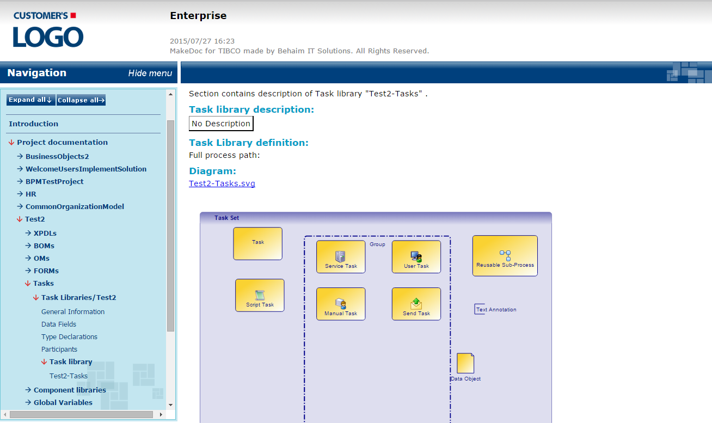

# Task Libraries {#taskLibraries .concept}

Task Library documentation consists of Data Fields, Diagram, Parameters, Participants, Tasks \(Maunal Tasks, Resusable Sub-Processes, Script Tasks, Send Tasks, Service Tasks, Tasks, User Tasks\), Type Declarations.

**Parent topic:**[Project Documentation](../../../modules/titanis/output/projectDocDetailBS.md)

