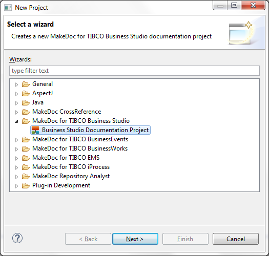
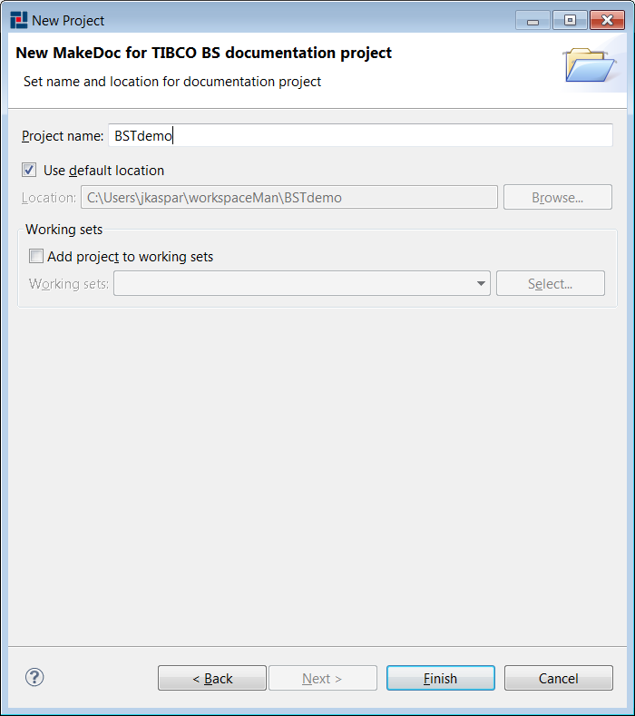
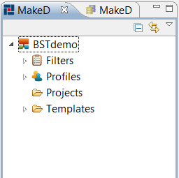

# Creating TIBCO Business Studio Module Project {#creatingBEModulProject .concept}

Chapter describes creation of TIBCO Business Studio Module project.

Name of project can be set in next wizard page.

MakeDoc creates main project structure after pressing Finish.

Project contains five folders:

-   Filters - contains filters for reducing generated documentation
-   Profiles - contains profiles for selecting TIBCO Business Studio project to document, output format of documentation and selecting of applied QualityAssurance rules
-   Projects - contains all TIBCO Business Studio projects to document
-   Rules - contains QualityAssurance rules
-   Templates - contains FreeMarker and XSL templates

**Parent topic:**[Dialogs](../../../../modules/titanis/setup/dialogs/dialogs.md)

