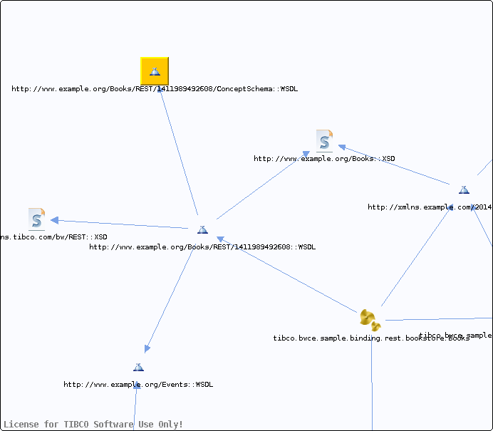

# http\_\_\_www.example.org\_Books\_REST\_1411989492608\_ConceptSchema\_\_WSDL\_\_unresolved {#http___www.example.org_Books_REST_1411989492608_ConceptSchema__WSDL__unresolved .concept}

Chapter contains http\_\_\_www.example.org\_Books\_REST\_1411989492608\_ConceptSchema\_\_WSDL\_\_unresolved crossreferences documentation.

Referenced From:

-   [http://www.example.org/Books/REST/1411989492608::WSDL](../../../projects/tibco.bwce.sample.binding.rest.BookStore/Service_Descriptors/Books.wsdl.md)

**Parent topic:**[WSDLs](../../../cross/dependencies/wsdls/wsdls.md)

